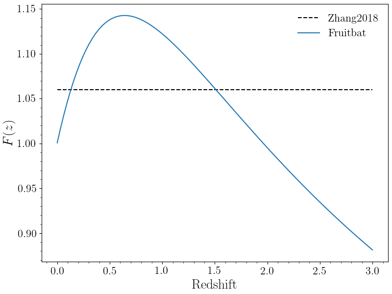

Methods and Cosmology
=====================

When using **fruitbat** there are different methods and cosmologies built-in from
which you can choose. Below is a brief description of how each method is calculated 
and the parameters for each cosmology.

Methods
*******
Currently there are three built-in dispersion measure-redshift relations. In **fruitbat** these are
referred to as 'methods'. To calculate the look-up tables **fruitbat** uses the equations described below
for each method to calculate the dispersion measre (:math:`\rm{DM}`) for a given redshift (:math:`z`).

F(z) Integral
-------------
The methods ``'Ioka2003'``, ``'Inoue2004'``, ``'Zhang2018'`` all have a common integral :math:`F(z)`.

.. math::

    F(z) = \int_0^z \frac{1 + z}{\left[\Omega_m(1+z)^3 + \Omega_{\Lambda} (1+z)^{3(1-w)} \right]^{1/2}}dz

Where :math:`z` is the redshift, :math:`\Omega_m` is the cosmic matter density, :math:`\Omega_{\Lambda}` is cosmic
dark energy density and :math:`w` characterises the dark energy equation of state.
This is typically assumed to have a constant value of :math:`\sim 1.06` which introduces an error of 
approximately 6\% for :math:`z < 2`.

The lookup tables in **fruitbat** explicitly solve this integral for each redshift to when calculating 
a dispersion measure. See the Figure below for a comparison between the assumed value and the integral in
**fruitbat**.

|Fz_Integral|

Ioka 2003
---------
The `Ioka (2003)`_ method assumes that all baryons in the Universe are fully ionised and that
there is a 1-to-1 relation between eletrons and baryons. i.e. The number is free electrons in the
Universe is the same as the number of baryons.
The DM at a given redshift using the Ioka method is calculated as follows:

.. math::
    
    \mathrm{DM} &= \frac{3 c H_0 \Omega_b}{8 \pi G m_p} F(z) \\
                &= 1108 \mathrm{pc\ cm^{-3}} F(z)

Where :math:`c` is the speed of light, :math:`H_0` is the Hubble constant, :math:`\Omega_b` is the cosmic baryon 
density, :math:`G` is the gravitational constant, :math:`m_p` is the mass of the proton and :math:`F(z)` is the integral defined earlier.

Inoue 2004
----------
The `Inoue (2004)`_ method assumes that hydrogen is fully ionised and helium is singly ionised. THe DM at a given redshift using the
Inoue method is calculated as follows.

.. math::

    \mathrm{DM} &= 9.2 \times 10^{-10} c H_0 \Omega_b F(z) \\
                &= 908 \mathrm{pc\ cm^{-3}} F(z) 

Where :math:`c` is the speed of light, :math:`H_0` is the Hubble constant, :math:`\Omega_b` is the cosmic baryon 
density and :math:`F(z)` is the integral defined earlier. The factor of :math:`9.2 \times 10^{-10}` comes estimating
the number of free electrons at high redshifts from models of reionisation.

Zhang 2018
----------
The `Zhang (2018)`_ method assumes that all baryons in the Universe are fully ionised and that
there is a 0.875-to-1 ratio between eletrons and baryons, and that 85% of baryons are in the intergalactic medium.
The DM at a given redshift using the Zhang method is calculated as follows:

.. math::
    
    \mathrm{DM} &= \frac{3 c H_0 \Omega_b \chi f_{igm}}{8 \pi G m_p} F(z) \\
                &= 805 \mathrm{pc\ cm^{-3}} \left(\frac{f_{igm}}{0.83}\right) \left(\frac{\chi}{0.875}\right) F(z)

Where :math:`c` is the speed of light, :math:`H_0` is the Hubble constant, :math:`\Omega_b` is the cosmic baryon 
density, :math:`G` is the gravitational constant, :math:`m_p` is the mass of the proton, :math:`\chi` is the free 
electron per baryon in the Universe, :math:`f_{igm}` is the fraction of baryons in the intergalactic medium 
and :math:`F(z)` is the integral defined earlier.

:math:`\chi` is calculated as follows:

.. math::

    \chi(z) = \frac{3}{4} y_1 \chi_{e, H}(z) + \frac{1}{8} y_2 \chi_{e, He}(z) 

Where :math:`\chi_{e, H}` and :math:`\chi_{e, He}` denote the ionisation fraction of hydrogen and helium respectively
and :math:`y_1 \sim y_2 \sim 1` denote the possible slight deviation from the 3/4 - 1/4 split of hydrogen and helium
abundance in the Universe. Assuming that hydrogen and helium are both ionised, then :math:`\chi(z) \sim 0.875`.

.. _Ioka (2003): https://adsabs.harvard.edu/abs/2003ApJ...598L..79I

.. _Inoue (2004): https://adsabs.harvard.edu/abs/2004MNRAS.348..999I 

.. _Zhang (2018): https://adsabs.harvard.edu/abs/2018ApJ...867L..21Z 

Cosmology
*********
Each method in **fruitbat** has a list of pre-calculated lookup tables with 
different cosmologies. The table below lists the parameters that are used for 
each cosmology.

.. table::
    :widths: auto
    :align: center
	
    =======================  ===============  ================  =================  ====================== =========
    Cosmological Parameters
    ---------------------------------------------------------------------------------------------------------------
       Keyword               :math:`H_0`      :math:`\Omega_b`  :math:`\Omega_m`   :math:`\Omega_\Lambda` :math:`w`
    =======================  ===============  ================  =================  ====================== =========
    ``'WMAP5'``               :math:`70.2`    :math:`0.0459`     :math:`0.277`     :math:`0.723`             -1
    ``'WMAP7'``               :math:`70.4`    :math:`0.0455`     :math:`0.272`     :math:`0.728`             -1
    ``'WMAP9'``               :math:`69.32`   :math:`0.04628`    :math:`0.2865`    :math:`0.7134`            -1
    ``'Planck13'``            :math:`67.77`   :math:`0.0483`     :math:`0.3071`    :math:`0.6914`            -1
    ``'Planck15'``            :math:`67.74`   :math:`0.0486`     :math:`0.3075`    :math:`0.6910`            -1
    ``'Planck18'``            :math:`67.66`   :math:`0.04897`    :math:`0.3111`    :math:`0.6874`            -1
    =======================  ===============  ================  =================  ====================== =========

Below is a figure comparing the different methods and cosmologies in **fruitbat**. The left figure shows how the different methods compare assuming a ``'Planck18'`` cosmology..
The right figure shows how the ``'Inoue2004'`` method changes with different assumed cosmologies.

|methods_cosmology|

.. |methods_cosmology| image:: ../figs/methods_cosmology_plots.png
